<div align="center">

# Fahim 🚀

### Intelligent Arabic PDF-to-Mind-Map & Knowledge Retrieval Engine

[](LICENSE)
[](https://www.typescriptlang.org/)
[](https://react.dev/)
[](https://vitejs.dev/)
[](https://deepmind.google/technologies/gemini/)

<p align="center">
  
</p>

[View Demo](https://github.com/MohammedNasserAhmed/Fahim) · [Report Bug](https://github.com/MohammedNasserAhmed/Fahim/issues) · [Request Feature](https://github.com/MohammedNasserAhmed/Fahim/issues)

</div>

---

## 📖 About

**Fahim** (Arabic for "Intelligent" or "Understanding") is a specialized **AI-powered Knowledge Extraction Engine** tailored for Arabic academic and technical documents.

Processing Arabic PDF content is notoriously difficult due to complex fonts, RTL layout issues, and disjointed ligatures. Fahim solves this by combining client-side extraction with a **Large Language Model (Gemini 2.5 Flash)** to reconstruct, analyze, and visualize semantic relationships in a document.

It transforms static, linear PDFs into **interactive, hierarchical Mind Maps**, enabling learners and researchers to "see" the structure of knowledge.

## ✨ Key Features

- **📄 Robust PDF Parsing**: Client-side text extraction using `pdf.js` tailored for Arabic text layers.
- **🧠 Semantic Reconstruction**: Uses **Google Gemini 2.5 Flash** to fix broken joins, incomplete sentences, and RTL scrambling artifacts.
- **🗺️ Interactive Data Visualization**: Automatically generates dynamic D3-based mind maps from unstructured text.
- **⚡ Frontend-First Architecture**: Zero-backend setup. All logic runs in the browser making it ultra-fast and secure.
- **📥 Export & Share**: Export visualizations to high-quality PDFs or share raw JSON logic.

---

## 🏗️ Architecture System

Fahim employs a **Browser-Based ETL (Extract, Transform, Load)** pipeline.

```mermaid
graph LR
    A[📄 PDF File] -->|Upload| B(Client Browser)
    B -->|Extract Text| C{PDF.js Engine}
    C -->|Raw Artifacts| D[📝 Text Normalizer]
    D -->|Context Window| E[🤖 Google Gemini API]
    E -->|Structured JSON| F[🌲 State Store]
    F -->|Render| G[🎨 D3.js Visualizer]
    F -->|Export| H[💾 PDF/Image]
    
    style E fill:#8E75B2,stroke:#333,stroke-width:2px,color:#fff
    style B fill:#61dafb,stroke:#333,stroke-width:2px
```



### The Pipeline
1.  **Extract**: `pdfService` iterates through binary PDF data.
2.  **Transform**: The raw text, often scrambled, is fed into Gemini with a strict schema prompt. The LLM acts as a semantic repair engine, outputting sanitized JSON `AnalyzedSection`.
3.  **Load**: React State updates the UI, rendering the Interactive Mind Map.

---

## 🛠️ Technology Stack

| Component | Technology | Description |
| :--- | :--- | :--- |
| **Core** |  | Modern UI with Server Components support (prepared). |
| **Language** |  | Strict type safety for complex JSON structures. |
| **Build** |  | Lightning fast HMR and optimized production build. |
| **AI Engine** |  | `gemini-2.5-flash` for high-throughput context processing. |
| **Viz** |  | Custom force-directed graphs for mind mapping. |
| **PDF Tools** | `jspdf`, `html2canvas` | Client-side rendering and export tools. |

---

## 🚀 Getting Started

### Prerequisites
- **Node.js** (v18+)
- **Google GenAI API Key** ([Get one here](https://aistudio.google.com/))

### Installation

1.  **Clone the repository**
    ```bash
    git clone https://github.com/MohammedNasserAhmed/Fahim.git
    cd Fahim
    ```

2.  **Install Dependencies**
    ```bash
    npm install
    ```

3.  **Configure Environment**
    Create a `.env` file in the root directory (or export variables in your shell):
    ```env
    # .env
    GEMINI_API_KEY=your_api_key_here
    ```
    > **Note**: The application expects the key to be available to the Vite client. Ensure you handle this securely.

4.  **Run Development Server**
    ```bash
    npm run dev
    ```

---

## 📂 Project Structure

```bash
Fahim/
├── 📂 public/              # Static assets and PDF.js worker scripts
├── 📂 src/
│   ├── 📂 components/      # React UI Components
│   │   ├── MindMap.tsx     # D3 Visualization logic
│   │   ├── Upload.tsx      # File handling zone
│   │   └── Export.tsx      # PDF Generation logic
│   ├── 📂 services/       
│   │   ├── gemini.ts       # AI Interaction Layer (Prompt Engineering)
│   │   └── pdf.ts          # PDF Extraction logic
│   ├── 📂 types/           # TS Interfaces (AnalyzedSection, MindMapNode)
│   └── App.tsx             # Main Application Logic
├── package.json
└── vite.config.ts
```

---

## 🔮 Roadmap

- [ ] **OCR Integration**: Add Tesseract.js for scanned image PDFs.
- [ ] **Vector Database**: Implement RAG (Retrieval Augmented Generation) for multi-pdf chatting.
- [ ] **Server Mode**: Optional Express/Next.js backend to proxy API requests and hide keys.
- [ ] **Multi-Format**: Support for Markdown and DOCX imports.

---

## 🤝 Contributing

Contributions are what make the open source community such an amazing place to learn, inspire, and create. Any contributions you make are **greatly appreciated**.

1.  Fork the Project
2.  Create your Feature Branch (`git checkout -b feature/AmazingFeature`)
3.  Commit your Changes (`git commit -m 'Add some AmazingFeature'`)
4.  Push to the Branch (`git push origin feature/AmazingFeature`)
5.  Open a Pull Request

---

## 👤 Author

**Mohammed Nasser Ahmed**

*   [GitHub Profile](https://github.com/MohammedNasserAhmed)

---

## 📄 License

Distributed under the MIT License. See `LICENSE` for more information.

<p align="center">
  <br>
  Built with ❤️ for the Arabic Open Source Community
</p>
